# Procesverslag
Markdown is een simpele manier om HTML te schrijven.  
Markdown cheat cheet: [Hulp bij het schrijven van Markdown](https://github.com/adam-p/markdown-here/wiki/Markdown-Cheatsheet).

Nb. De standaardstructuur en de spartaanse opmaak van de README.md zijn helemaal prima. Het gaat om de inhoud van je procesverslag. Besteedt de tijd voor pracht en praal aan je website.

Nb. Door *open* toe te voegen aan een *details* element kun je deze standaard open zetten. Fijn om dat steeds voor de relevante stuk(ken) te doen.

## Jij

  
uitwerken voor kick-off werkgroep

  ### Auteur:
  Suzanne Moolenburgh

  #### Je startniveau:
  Blauw / Rood

  #### Je focus:
  Responsive
 

## Je website

  
uitwerken voor kick-off werkgroep

  ### Je opdracht:
  https://www.airbnb.nl/

  #### Screenshot(s) van de eerste pagina (small screen): 
  Startpagina 
  

  #### Screenshot(s) van de tweede pagina (small screen):
  Advertentie
  
 

## Toegankelijkheidstest 1/2 (week 1)

  
uitwerken na test in 2e werkgroep

  ### Bevindingen
  Airbnb heeft goede headings met duidelijke benamingen. Het is makkelijk om hierdoor te navigeren. Ondanks dat ze geen zichtbare h1 op de startpagina hebben, hebben ze deze wel verborgen. De screenreader leest 'Startpagina van Airbnb' voor.
  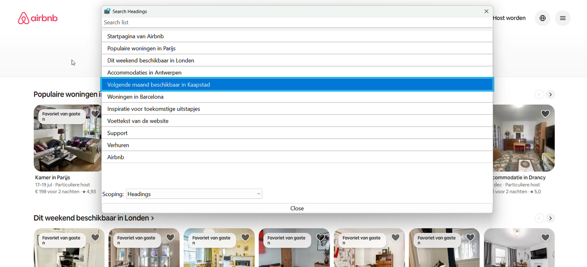
  Ook de links zijn duidelijk aangegeven. De namen zijn logisch en geven goed aan waar je als gebruiker naartoe navigeert op het moment dat je erop klikt. Er is ook een 'skip links' aanwezig, zodat gebruikers met een screenreader gelijk naar de inhoud kunnnen navigeren.
  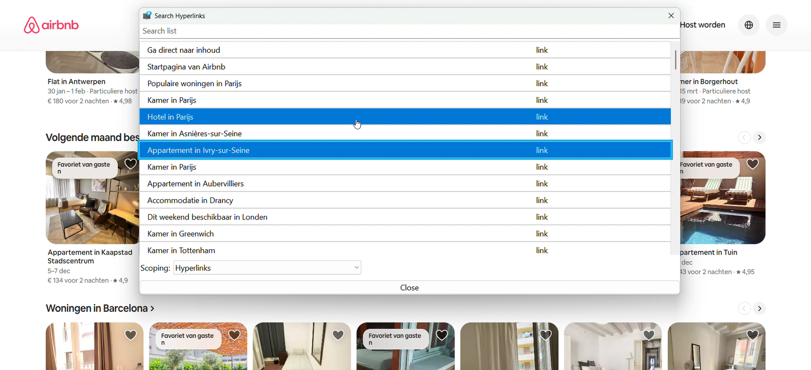
  De kopjes op een advertentie pagina zijn minder duidelijk. Als ik voor het eerst op de site zou komen, zou ik bijvoorbeeld zonder visuele context niet direct weten wat "December 2025" betekent.
  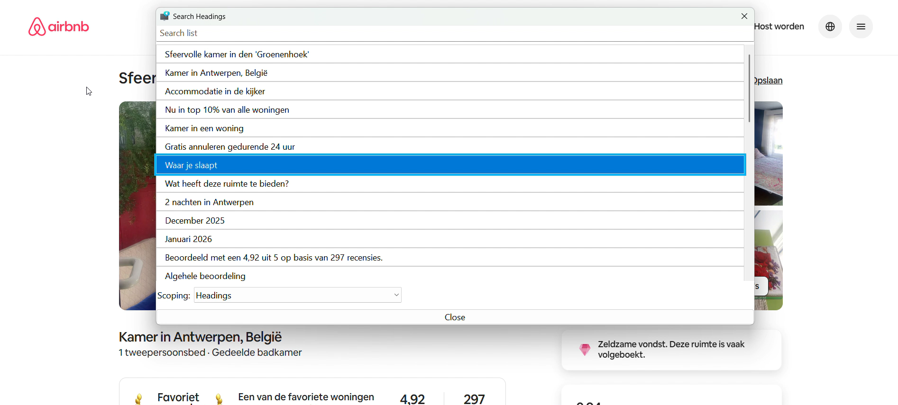
  De hyperlinks zijn logisch, zolang je eerst de context van de kopjes hebt. Als je alleen snel door de links zou willen navigeren, zou je waarschijnlijk niet direct weten waar je naartoe zou moeten navigeren.
  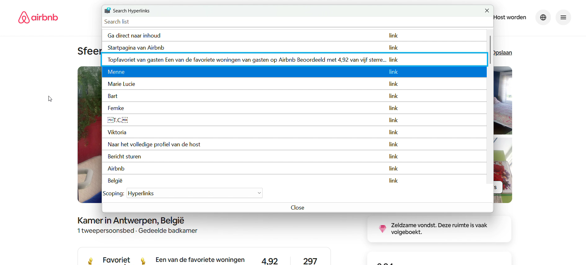
  Uit de test bleek dat Airbnb op veel vlakken goed heeft nagedacht over toegankelijkheid. Los van de headings hebben ze bijvoorbeeld ook een goede toetsenbordnavigatie, zijn afbeeldingen en kaarten voorzien van alternatieve tekst en is er een goed kleurcontrast. Ook reageert de site op bijvoorbeeld de hoge-contrast modus en tekstvergroting.
  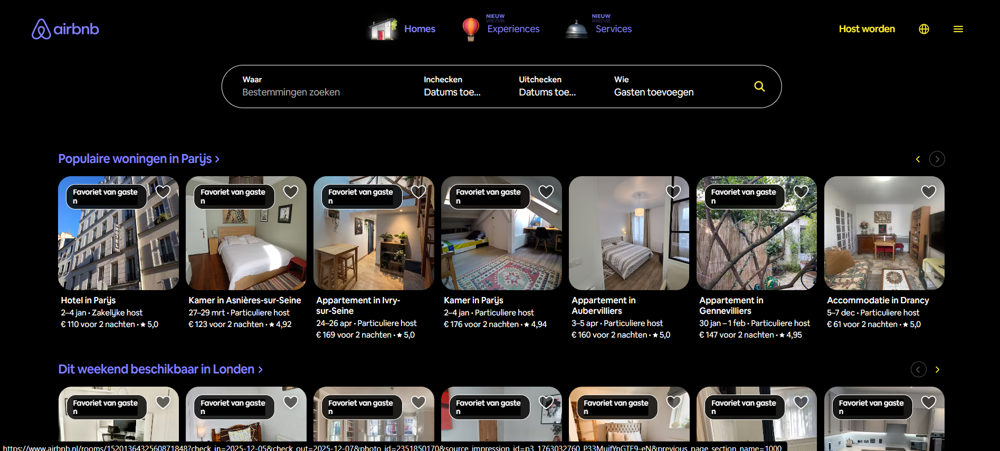
  Airbnb heeft nog wel kleine verbeterpunten. Zo gebruiken ze bijvoorbeeld veel carrousels en lijsten, maar hiervoor worden div's gebruikt, in plaats van lijst elementen. Ook hebben pagina's geen eigen titel en maakt alleen de startpagina gebruikt van een verborgen h1. Airbnb ondersteunt ook geen dark mode.
  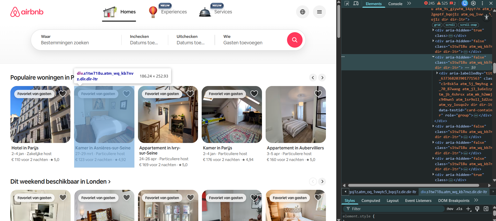

## Breakdownschets (week 1)

  
uitwerken na afloop 3e werkgroep

  ### de hele pagina: 
  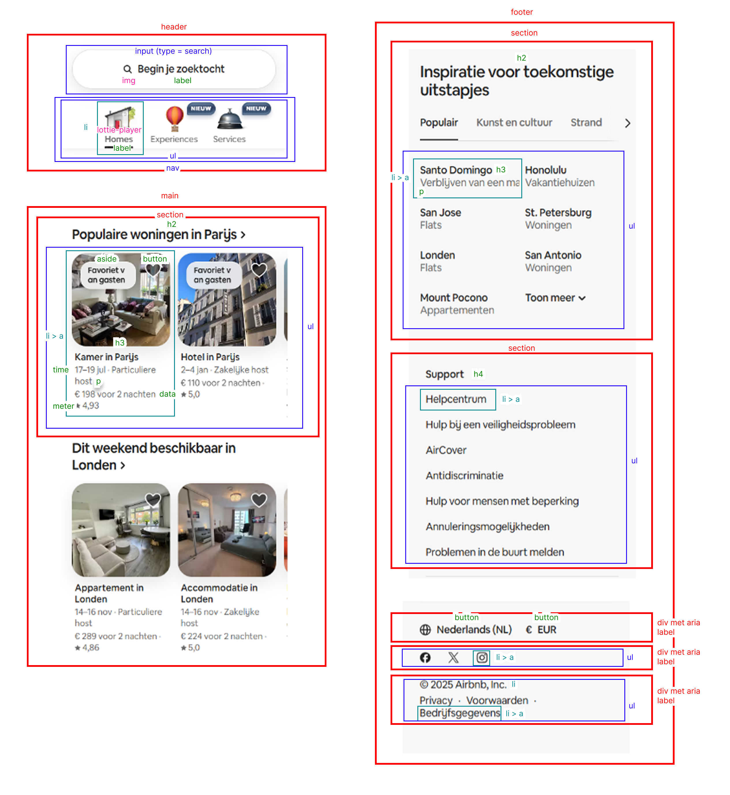

  ### dynamisch: 
  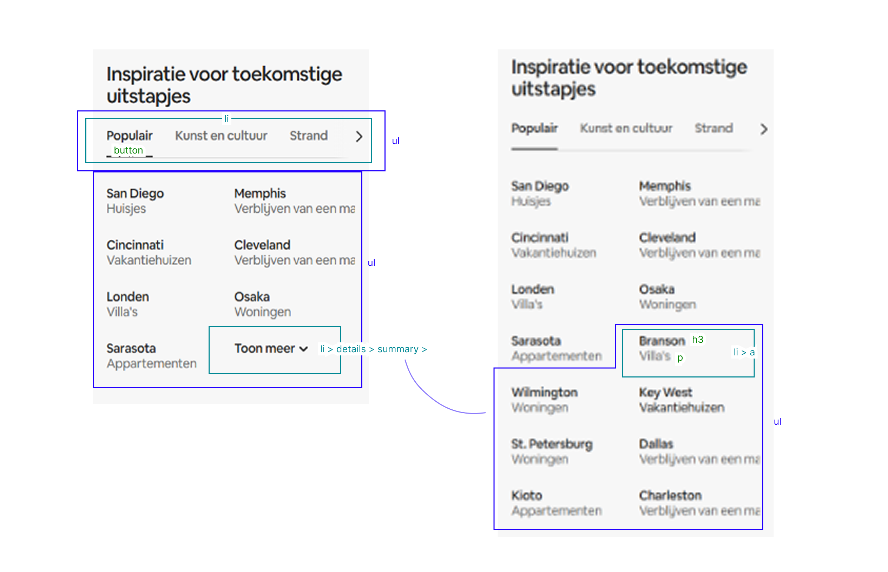

## Voortgang 1 (week 2)

  
uitwerken voor 1e voortgang

  ### Stand van zaken
  In de eerste twee weken ben ik al een eind gekomen. Ik ben vooral bezig geweest met de header, met name het invoegen van animaties en het responsive maken.
  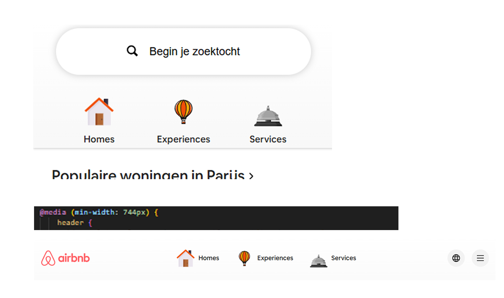
  Ook ben ik begonnen met het caroussel voor de advertenties. Dit gaat tot nu toe ook goed.
  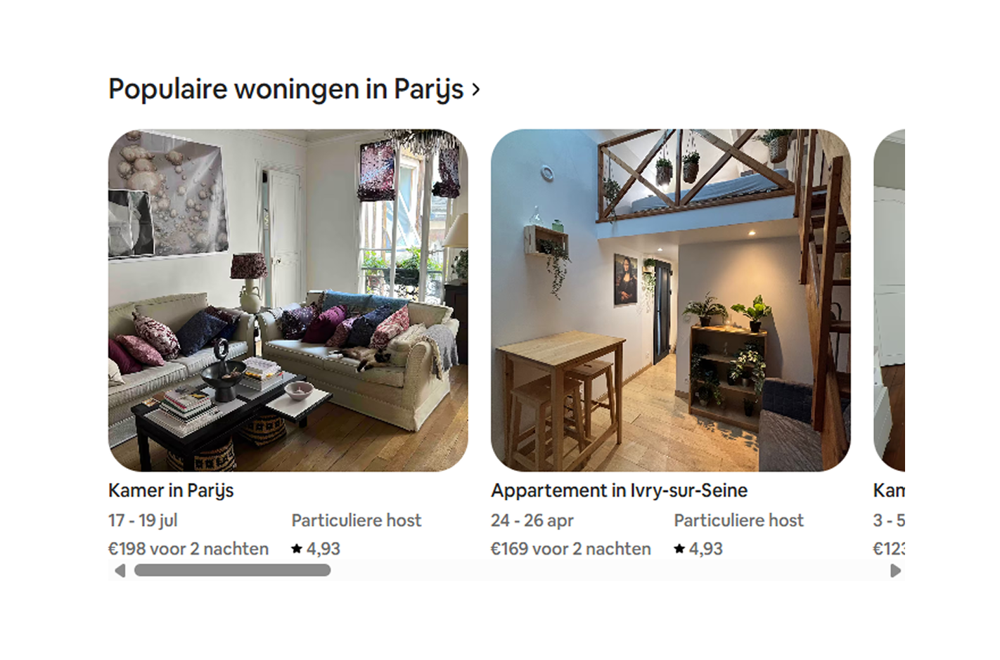
  Ik heb me tijdens de eerste twee weken wel gerealizeerd dat de website die ik heb gekozen moeilijk is dan ik van tevoren had verwacht. De lastigste onderdelen op dit moment waar ik ook nog niet uit ben gekomen zijn de footer en de responsive form zoekbalk.
  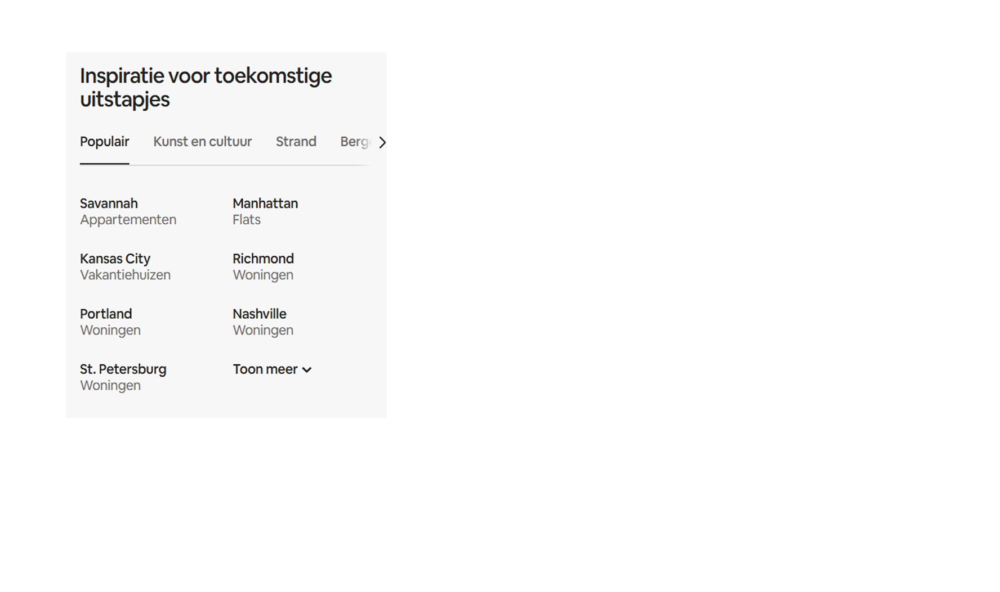

  ### Agenda voor meeting
  samen met je groepje opstellen

  | Suzanne     | Romaisa          | Irem    | Marissa       | Caspar
  | Vraag over form met button + input + popover element                  | ---                | ---          | ---              |
  | Footer tabbladen          | en dit             | en ik dit    | en dan ik dat    |
  | Aria-labels        | dit als er tijd is | nog een punt | dit wil ik zeker |
  | Herkleuren SVG iconen met CSS                     | ...                | ...          | ...              |

  ### Verslag van meeting
  hier na afloop snel de uitkomsten van de meeting vastleggen

  - punt 1
  - punt 2
  - nog een punt
  - ...

## Voortgang 2 (week 3)

  
uitwerken voor 2e voortgang

  ### Stand van zaken
  hier dit ging goed & dit was lastig (neem ook screenshots op van delen van je website en code)

  ### Agenda voor meeting
  samen met je groepje opstellen

  | student 1      | student 2          | student 3    | student 4        |
  | ---            | ---                | ---          | ---              |
  | dit bespreken  | en dit             | en ik dit    | en dan ik dat    |
  | en dat ook nog | dit als er tijd is | nog een punt | dit wil ik zeker |
  | ...            | ...                | ...          | ...              |

  ### Verslag van meeting
  hier na afloop snel de uitkomsten van de meeting vastleggen

  - punt 1
  - punt 2
  - nog een punt
- ...

## Toegankelijkheidstest 2/2 (week 4)

  
uitwerken na test in 9e werkgroep

  ### Bevindingen
  Lijst met je bevindingen die in de test naar voren kwamen (geef ook aan wat er verbeterd is):

## Voortgang 3 (week 4)

  
uitwerken voor 3e voortgang

  ### Stand van zaken
  hier dit ging goed & dit was lastig (neem ook screenshots op van delen van je website en code)

  ### Agenda voor meeting
  samen met je groepje opstellen

  | student 1      | student 2          | student 3    | student 4        |
  | ---            | ---                | ---          | ---              |
  | dit bespreken  | en dit             | en ik dit    | en dan ik dat    |
  | en dat ook nog | dit als er tijd is | nog een punt | dit wil ik zeker |
  | ...            | ...                | ...          | ...              |

  ### Verslag van meeting
  hier na afloop snel de uitkomsten van de meeting vastleggen

  - punt 1
  - punt 2
  - nog een punt
  - ...

## Eindgesprek (week 5)

  
uitwerken voor eindgesprek

  ### Je uitkomst - karakteristiek screenshots:
  

  ### Dit ging goed/Heb ik geleerd: 
  Korte omschrijving met plaatjes

  

  ### Dit was lastig/Is niet gelukt:
  Korte omschrijving met plaatjes

  

## Bronnenlijst

  
continu bijhouden terwijl je werkt

  Nb. Wees specifiek ('css-tricks' als bron is bijv. niet specifiek genoeg). 
  Nb. ChatGpT en andere AI horen er ook bij.
  Nb. Vermeld de bronnen ook in je code.

  1. bron 1
  2. bron 2
  3. ...

