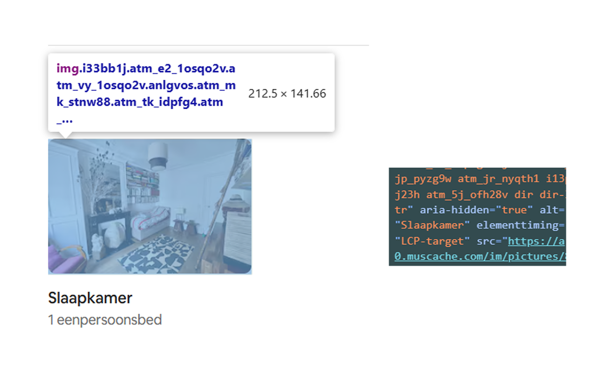
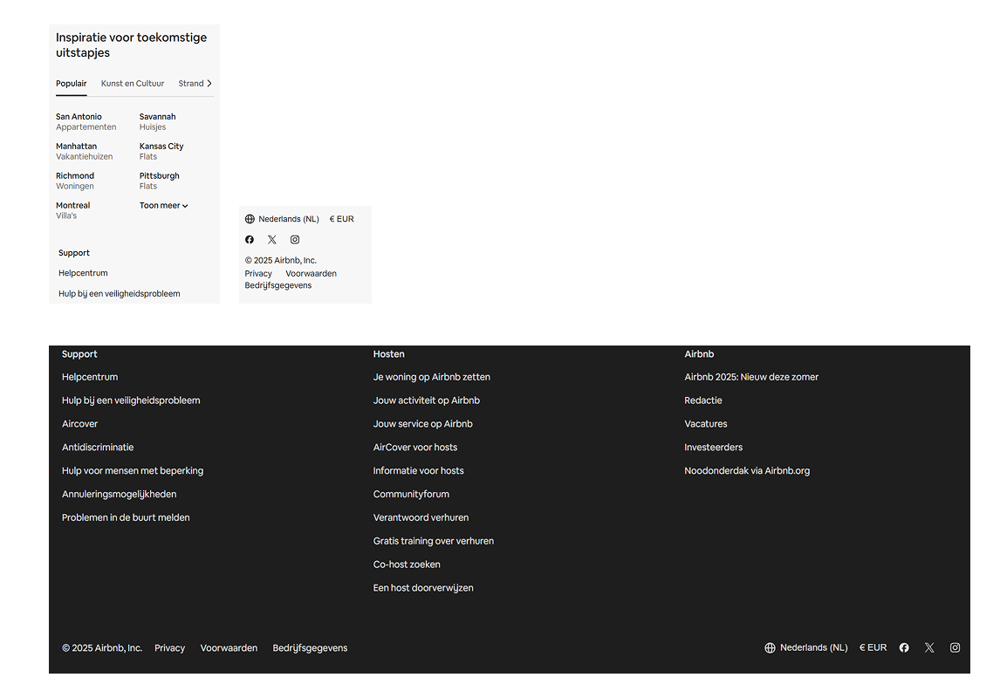
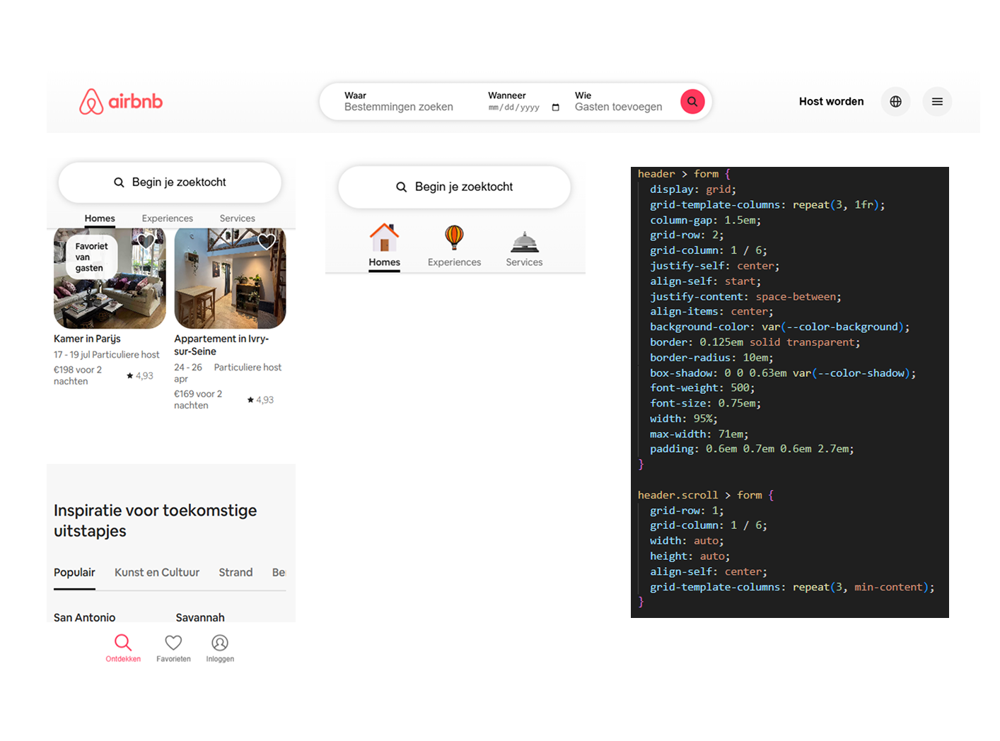
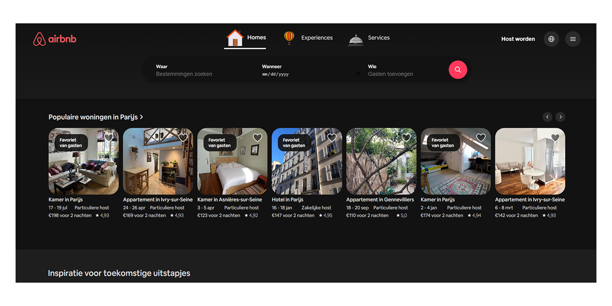
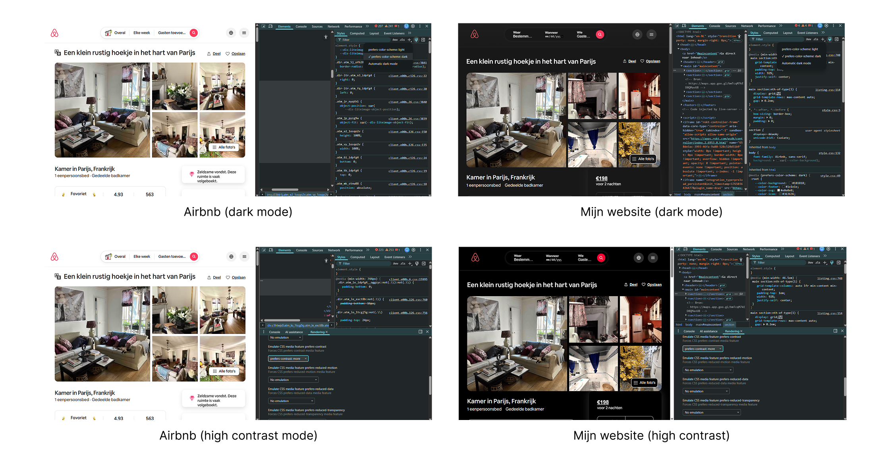
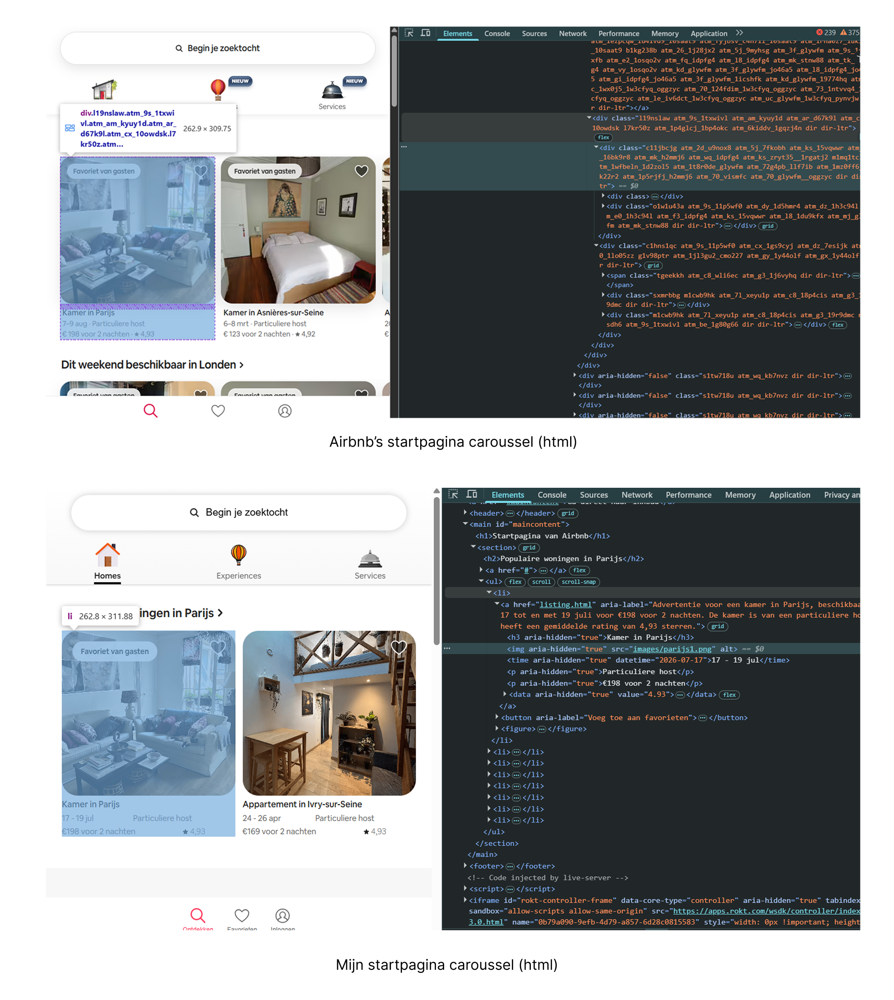
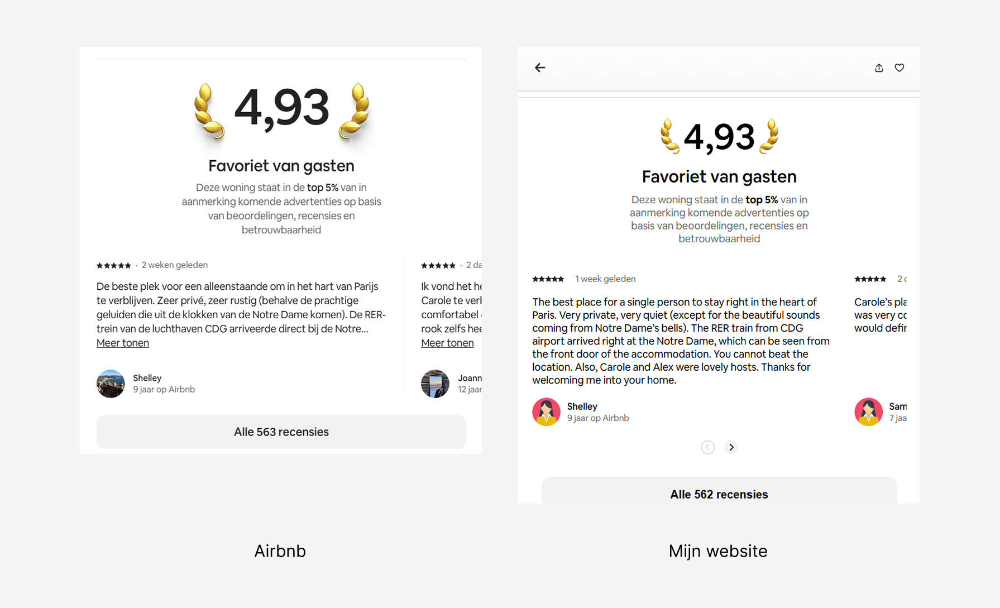
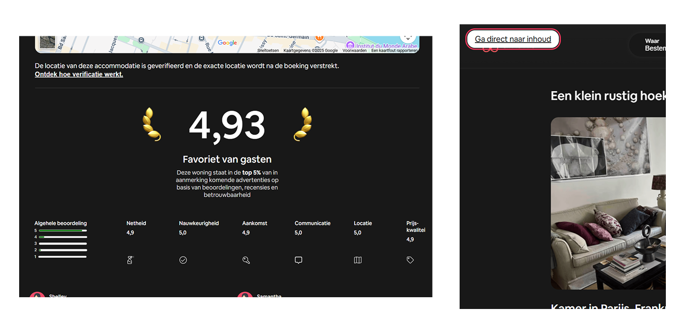
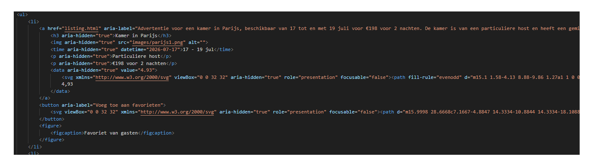

# Procesverslag
Markdown is een simpele manier om HTML te schrijven.  
Markdown cheat cheet: [Hulp bij het schrijven van Markdown](https://github.com/adam-p/markdown-here/wiki/Markdown-Cheatsheet).

Nb. De standaardstructuur en de spartaanse opmaak van de README.md zijn helemaal prima. Het gaat om de inhoud van je procesverslag. Besteedt de tijd voor pracht en praal aan je website.

Nb. Door *open* toe te voegen aan een *details* element kun je deze standaard open zetten. Fijn om dat steeds voor de relevante stuk(ken) te doen.

## Jij

  
uitwerken voor kick-off werkgroep

  ### Auteur:
  Suzanne Moolenburgh

  #### Je startniveau:
  Blauw / Rood

  #### Je focus:
  Responsive
 

## Je website

  
uitwerken voor kick-off werkgroep

  ### Je opdracht:
  https://www.airbnb.nl/

  #### Screenshot(s) van de eerste pagina (small screen): 
  Startpagina 
  

  #### Screenshot(s) van de tweede pagina (small screen):
  Advertentie
  
 

## Toegankelijkheidstest 1/2 (week 1)

  
uitwerken na test in 2e werkgroep

  ### Bevindingen
  Airbnb heeft goede headings met duidelijke benamingen. Het is makkelijk om hierdoor te navigeren. Ondanks dat ze geen zichtbare h1 op de startpagina hebben, hebben ze deze wel verborgen. De screenreader leest 'Startpagina van Airbnb' voor.
  
  Ook de links zijn duidelijk aangegeven. De namen zijn logisch en geven goed aan waar je als gebruiker naartoe navigeert op het moment dat je erop klikt. Er is ook een 'skip links' aanwezig, zodat gebruikers met een screenreader gelijk naar de inhoud kunnnen navigeren.
  
  Uit de test bleek dat Airbnb op veel vlakken goed heeft nagedacht over toegankelijkheid. Los van de headings hebben ze bijvoorbeeld ook een goede toetsenbordnavigatie, zijn afbeeldingen en kaarten voorzien van alt tekst en is er een goed kleurcontrast. Ook reageert de site op tekstvergroting. De site reageert alleen niet op dark mode of hoog contrast.
  
  Het andere nog grote verbeterpunt voor Airbnb zijn de html elementen die ze gebruiken. Voor bijna alles wordt een div of span gebruikt. Zo gebruiken ze bijvoorbeeld veel carrousels en lijsten, maar hiervoor worden div's gebruikt, in plaats van lijst elementen.
  

## Breakdownschets (week 1)

  
uitwerken na afloop 3e werkgroep

  ### de hele pagina: 
  

  ### dynamisch: 
  

## Voortgang 1 (week 2)

  
uitwerken voor 1e voortgang

  ### Stand van zaken
  In de eerste twee weken ben ik al een eind gekomen. Ik ben vooral bezig geweest met de header, met name het invoegen van animaties en het responsive maken.
  
  Ook ben ik begonnen met het carrousel voor de advertenties. Dit gaat tot nu toe ook goed.
  
  Ik heb me tijdens de eerste twee weken wel gerealizeerd dat de website die ik heb gekozen moeilijk is dan ik van tevoren had verwacht. De lastigste onderdelen op dit moment waar ik ook nog niet uit ben gekomen zijn de footer en de responsive form zoekbalk.
  

  ### Agenda voor meeting
  samen met je groepje opstellen

  Suzanne:
  1.	Vraag over form met button + input + popover element
  2.	Footer tabbladen
  3.	Aria-labels
  4.	Herkleuren SVG iconen met CSS

  Romaisa:
  1. Hamburger menu icoon kleiner krijgen en zonder achtergrond
  2. Welke sections kan ik het beste gebruiken
  3. Javascript naar css en html beter begrijpen
  4. Aria labels
  5. Article

  Irem:

  Marissa:

  Caspar:

  ### Verslag van meeting

  De meeting ging goed, ik heb antwoorden op al mijn vragen gehad dus ik kan nu zeker verder met mijn website. De belangrijkste punten:

  - De juiste html elementen voor het maken van mijn form zoekbalk bij een groter scherm.
  - Het maken van de tabbladen carrousel in mijn footer.
  - Info warning bij validation voor aria labels
  - Het gebruiken en aanpassen van de kleur van svg iconen

  Ook heb ik aan vragen van anderen in mijn groepje veel gehad, met name over de scroll knoppen (die mijn website ook heeft) en light/dark mode.

## Voortgang 2 (week 3)

  
uitwerken voor 2e voortgang

  ### Stand van zaken
  Afgelopen week is het gelukt om mijn eerste pagina zo goed als af te ronden.
  
  Ook heb ik de eerste animaties met Javascript gedaan, op mijn site zitten deze vooral in de header.
  
  Ik heb mijn site ook een dark mode gegeven. Helaas heeft Airbnb deze zelf nog niet dus ik heb eigen kleurvarianten van het bestaande kleurenpalet gebruikt.
  

  ### Agenda voor meeting
  samen met je groepje opstellen

  Suzanne:
  1.	Aria labels op data & time elementen
  2.	Hulp bij scroll footer

  Romaisa:
  1. Position relative en absolute op plaatjes goed responsive maken 
  2. Foto goed schalen en schaduw erop toevoegen

  Irem:

  Marissa:

  Caspar:

  ### Verslag van meeting
  hier na afloop snel de uitkomsten van de meeting vastleggen

  Uit de meeting bleek dat bij mij het 'scrollen' op het moment dat de :target wordt geselecteerd onvermijdelijk is door de manier waarop ik het heb gedaan met een id,   maar dit was gelukkig niet erg. Wel raadde ze aan om een smooth scroll-behavior op de html te zetten, zodat het nu in elk geval niet meer zo 'heftig' eruit ziet.

  Wat betreft mijn vraag over de aria-labels kwamen we er niet uit, dus dit moet ik komende week nog verder gaan uitzoeken.

## Toegankelijkheidstest 2/2 (week 4)

  
uitwerken na test in 9e werkgroep

  ### Bevindingen
  Uit mijn tweede test bleek dat mijn website verbeterd is ten opzichte van Airbnb. Zo reageert mijn website op zowel dark mode als high contrast.
  
  Ook maak ik gebruik van semantische html elementen, waar Airbnb div'jes gebruikt.
  
  Op klein (mobiel en tablet) formaat heb ik op drie plekken scrollknoppen toegevoegd bij carrousels waar je op Airbnb alleen horizontaal kan scrollen. Ook heeft mijn website op meerdere plekken verborgen kopjes, terwijl Airbnb dit alleen voor de h1 op de startpagina heeft.
  
  Airbnb scoorde op veel andere onderdelen al goed dus deze heb ik ook allemaal toegevoegd aan mijn website. Bijvoorbeeld aria-labels, skip links, goed formaat op mobiel, focus style (en andere button states), alt teksten en een reduced-motion media query voor mijn header en footer animaties.
  

## Voortgang 3 (week 4)

  
uitwerken voor 3e voortgang

  ### Stand van zaken
  Afgelopen week is het gelukt om mijn twee pagina's wat betreft HTML en CSS zo goed als af te krijgen.

  
  
  In de tweede helft van de week ben ik dan ook vooral bezig geweest met de toegankelijkheid van mijn website door bijvoorbeeld verder te gaan met het toevoegen van button states, skip links, aria labels en een media query voor reduced motion bij animaties. Ook heb ik enkele alt teksten van plaatjes verbeterd en meer beschrijvend gemaakt (ook 'Foto van...' weggehaald) en ben ik mijn site aan het testen (en verbeteren) op basis van de screenreader en mobiel landscape formaat.

  

  De laatste paar dagen hoop ik hier en daar nog kleine verbeteringen te kunnen doen en uiteindelijk een goed resultaat te kunnen opleveren.

  ### Agenda voor meeting
  samen met je groepje opstellen

  Suzanne:
  1. Feedback aria labels
  2. Vraag bronvermelding

  Romaisa:
  1. Requirement rood krijgen 
  2. tekst op de svg

  Irem:

  Marissa:

  Caspar:

  ### Verslag van meeting
  hier na afloop snel de uitkomsten van de meeting vastleggen

  - Mijn aria-labels op mijn advertentie carrousel kaartjes waren goed, dus ik ga nu de komende dagen op dezelfde manier nog aria-labels toevoegen aan de rest van mijn html.
  - Ook hebben we het bij de meeting nog weer gehad over scroll knoppen. Ik realizeerde me dat ik deze had toegevoegd op plekken waar Airbnb dit ook had, maar nog niet op andere plekken waar er wel horizontaal gescrold wordt, dus dit ga ik de komende dagen ook nog verbeteren.
  - Goed om ook nog github een extra keer te checken of al mijn bestanden goed worden overgedragen en gelezen.

## Eindgesprek (week 5)

  
uitwerken voor eindgesprek

  ### Je uitkomst - karakteristiek screenshots:
  

  ### Dit ging goed/Heb ik geleerd: 
  Korte omschrijving met plaatjes

  

  ### Dit was lastig/Is niet gelukt:
  Korte omschrijving met plaatjes

  

## Bronnenlijst

  
continu bijhouden terwijl je werkt

  HTML:
  1. https://stackoverflow.com/questions/69335456/responsive-images-via-picture-element-and-media-queries-via-css
  2. https://developer.mozilla.org/en-US/docs/Web/HTML/Reference/Elements
    - https://developer.mozilla.org/en-US/docs/Web/HTML/Reference/Elements/picture
    - https://developer.mozilla.org/en-US/docs/Web/HTML/Reference/Elements/datalist
    - https://developer.mozilla.org/en-US/docs/Web/HTML/Reference/Elements/output
  3. https://lottiefiles.com/blog/working-with-lottie-animations/how-to-add-lottie-animation-in-web-page-html
  4. https://maps.app.goo.gl/bmTcqM7kED8QMavU8

  CSS:
  1. https://developer.mozilla.org/en-US/docs/Web/CSS/Reference/Selectors/::placeholder
  2. https://developer.mozilla.org/en-US/docs/Web/HTML/Reference/Elements/details
  3. https://www.a11yproject.com/posts/how-to-hide-content/ (Post via Teams)
  4. https://chrome.dev/carousel-configurator/
  5. https://www.digitalocean.com/community/tutorials/css-cropping-images-object-fit

  Javascript:
  1. https://stackoverflow.com/questions/19158559/how-to-fix-a-header-on-scroll
  2. https://developer.mozilla.org/en-US/docs/Web/API/Window/scrollY
  3. https://developer.mozilla.org/en-US/docs/Web/API/Element/scroll
  4. https://stackoverflow.com/questions/51219064/run-function-only-on-index-html-page-javascript

  Bestanden:
  1. https://lottiefiles.com/free-animation/house-6kPsctVAb3 (Homes icoon)
  2. https://lottiefiles.com/free-animation/air-balloon-D7slE4qepR (Experiences icoon)
  3. https://lottiefiles.com/free-animation/hotel-bell-YCVW7mqJoB (Services icoon)
  4. https://www.freepik.com/icon/woman_6997662#fromView=keyword&page=1&position=2&uuid=8eed55b1-2946-4182-b7b0-1430b7c773b7 (Vervanging profielfoto host)
  5. https://icon-icons.com/icon/female-woman-user-people-avatar-white-tone/159354 (Vervanging profielfoto's reviewers)

